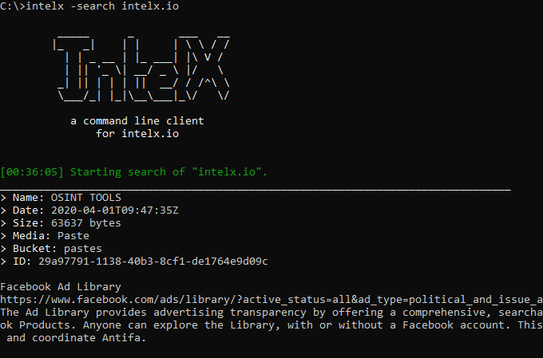

# intelx.py (0.5)

intelx.py is a Python command-line utility and API wrapper for intelx.io, made to perform any kind of open-source intelligence.



## Installation
```bash
git clone https://github.com/IntelligenceX/SDK
pip3 install SDK/Python
```

## Setup

To specify the API key to use, you can choose one of two options:
* Setting the `INTELX_KEY` environment variable.
* Manually supplying the `-apikey` argument.

You can get your API key here: https://intelx.io/account?tab=developer

##### Environment Variable
```bash
# create an INTELX_KEY env var with your API key.
export INTELX_KEY=00000000-0000-0000-0000-000000000000
```

##### Via the client

```bash
intelx.py -search riseup.net -apikey 00000000-0000-0000-0000-000000000000
```

## Configuration

On windows, we need to manually configure the command prompt/terminal in order to enable color support. You can do that with the following instructions:

1. Create following file `Enable Color.reg`
```
Windows Registry Editor Version 5.00
[HKEY_CURRENT_USER\Console]
"VirtualTerminalLevel"=dword:00000001
```

2. Right Click `Enable Color.reg` -> Merge

## Usage

```bash
intelx.py -search riseup.net
```


#### Quick search
```bash
intelx.py -search riseup.net
```

#### Quick search in buckets
```bash
intelx.py -search riseup.net -buckets "pastes, darknet.tor"
```

#### Search with 100 results
```bash
intelx.py -search riseup.net -limit 100
```

#### Download Item

The `-download` argument will set the HTTP request type to a stream, ultimately returning the raw bytes.
This allows us to download documents such as PDFs, ZIP, Word documents, Excel, etc.
You may set the filename with the `-name` argument.
```bash
# save item as test.pdf
intelx.py -download 29a97791-1138-40b3-8cf1-de1764e9d09c -name test.txt
```

#### View Item

To view the full data of a specific search result, specify the item's ID and use the `--view` parameter:

```bash
intelx.py -search 3a4d5699-737c-4d22-8dbd-c5391ce805df --view
```

#### Search Phonebook
```bash
intelx.py -search cia.gov --phonebook
```

#### Extract email from phonebook search
```bash
intelx.py -search cia.gov --phonebook --emails
```


# Usage as a library

To use IntelX it as a library, all you have to do is import it in your project, and initialize the class. If you supply an API key, it will use that, if not, it will automatically select the public API key (limited functionality).

```python
from intelxapi import intelx
intelx = intelx()
```

Once you have done that, you can use any of the functions defined in the class.

### Quick search

To execute a quick search, we can easily just use the `intelx.search()` function.

```python
from intelxapi import intelx

intelx = intelx('00000000-0000-0000-0000-000000000000')
results = intelx.search('hackerone.com')
```

### Advanced search

By default, the `maxresults` limit is set to 100 to avoid unnecessarily overloading the system. This value can be overridden at any time by setting the maxresults argument. Note that server side limitations might be still enforced by the API.

```python
from intelxapi import intelx

intelx = intelx('00000000-0000-0000-0000-000000000000')
results = intelx.search('hackerone.com', maxresults=200)
```

The following arguments have default values, but can be overridden to your choosing:

* maxresults=100
* buckets=[]
* timeout=5
* datefrom=""
* dateto=""
* sort=4
* media=0
* terminate=[]

Timeout is in seconds.

#### Searching in specific Buckets

To search a for a term within specific buckets (leaks & darknet), you can use the following sample code:

```python
from intelxapi import intelx

b = ['darknet', 'leaks.public', 'leaks.private']

intelx = intelx('00000000-0000-0000-0000-000000000000')
results = intelx.search('hackerone.com', maxresults=200, buckets=b)
```

`results` contains the search results.

Note that your account must have access to all specified buckets, otherwise you will receive the HTTP status code `401 Unauthorized`. The "leaks.private" bucket is only available to certain licenses.

#### Filtering by Date

Results can be filterede by date. When setting the `dateto` and `datefrom` options, both must be specified. The times have to be included.

```python
from intelxapi import intelx

startdate = "2014-01-01 00:00:00"
enddate = "2014-02-02 23:59:59"

intelx = intelx('00000000-0000-0000-0000-000000000000')

results = intelx.search(
   'riseup.net',
   maxresults=200,
   datefrom=startdate,
   dateto=enddate
)
```

#### Filtering by Data Type

We can filter results based on their data type using the `media` argument.

Using the following script, we can filter paste documents dated between 2014-01-01 and 2014-02-02 that have been collected.

You can find a table below with all the media types and their respective IDs.

```python
from intelxapi import intelx

media_type = 1 # Paste document
startdate = "2014-01-01 00:00:00"
enddate = "2014-02-02 23:59:59"

intelx = intelx('00000000-0000-0000-0000-000000000000')

results = intelx.search(
   'riseup.net',
   maxresults=200,
   media=media_type,
   datefrom=startdate,
   dateto=enddate
)
```

#### Statistics

To collect statistics, use the following code:

```python
from intelxapi import intelx

intelx = intelx('00000000-0000-0000-0000-000000000000')

results = intelx.search(
   'riseup.net',
   maxresults=1000,
)

stats = intelx.stats(search)
print(stats)
```

### Viewing/reading files

There is one fundamental difference between the `FILE_VIEW` function and `FILE_READ` function. Viewing is for quickly viewing contents of a file (generally assumed to be text).
`FILE_READ`, on the other hand, is for direct data download.

This means if the resource is a ZIP/Binary or any other type of file, you can reliably get the contents without any encoding issues.

#### Viewing

```python
from intelxapi import intelx

intelx = intelx()
results = intelx.search('riseup.net')

# use the first result
result = results['records'][0]

# grab file contents of first search result
contents = intelx.FILE_VIEW(result['type'], result['media'], result['storageid'], result['bucket'])

print(contents)
```

#### Reading

To download/read a file's raw data, use the `FILE_READ` function. The file in the below example will be saved as `file.txt`.

```python
from intelxapi import intelx

intelx = intelx()
results = intelx.search('riseup.net')

# save the first search result file as "file.txt"
intelx.FILE_READ(results['records'][0]['systemid'], 0, results['records'][0]['bucket'], "file.txt")
```

### Other Notes

#### Media Types

Here is a table listing the media types, along with their respective IDs.

| ID            | Media Type                         |
| ------------- | -----------------------------------|
| 0             | All                                |
| 1             | Paste document                     |
| 2             | Paste user                         |
| 3             | Forum                              |
| 4             | Forum board                        |
| 5             | Forum thread                       |
| 6             | Forum post                         |
| 7             | Forum user                         |
| 8             | Screenshot of website              |
| 9             | HTML copy of website               |
| 13            | Tweet                              |
| 14            | URL                                |
| 15            | PDF document                       |
| 16            | Word document                      |
| 17            | Excel document                     |      
| 18            | Powerpoint document                |    
| 19            | Picture                            |
| 20            | Audio file                         |
| 21            | Video file                         |
| 22            | Container file (ZIP/RAR/TAR, etc)  |
| 23            | HTML file                          |
| 24            | Text file                          |


#### Format Types

| ID |      Format Type                    |
|----|-------------------------------------|
| 0  |	textview of content                |
| 1  |	hex view of content                |
| 2  |	auto detect hex view or text view  |
| 3  |	picture view                       |
| 4  |	not supported                      |
| 5  | 	html inline view (sanitized)       |
| 6  |	text view of pdf                   |
| 7  |	text view of html                  |
| 8  |	text view of word file             |


## Contribute

Please use the issue tracker at https://github.com/IntelligenceX/SDK/issues to report any bugs, security vulnerabilities or feature requests.

